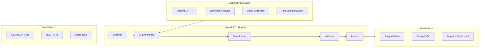

# Architecture Documentation

## System Architecture

## Pipeline Stages

### 1. Extraction
- Multi-source data ingestion (files, APIs, databases)
- Schema inference and validation
- Incremental extraction with watermark tracking

### 2. AI Enrichment
- OpenAI GPT-4 integration for text analysis
- Batch processing with rate limiting and retry logic
- Token usage tracking and cost optimization
- Configurable prompt templates per use case

### 3. Transformation
- Data type standardization
- Null handling and deduplication
- Feature engineering from AI outputs
- Business rule application

### 4. Validation
- Schema conformance checks
- Statistical distribution validation
- Referential integrity verification
- Data quality scoring

### 5. Loading
- Multi-format output (Parquet, CSV, database)
- Upsert/merge capabilities
- Partition management
- Write-ahead logging for fault tolerance

## Technology Stack

| Component | Technology | Purpose |
|---|---|---|
| Language | Python 3.9+ | Core pipeline logic |
| AI Engine | OpenAI API (GPT-4) | Text enrichment |
| Data Processing | Pandas / Polars | DataFrame operations |
| Validation | Pydantic / Great Expectations | Schema validation |
| API Framework | FastAPI | REST endpoints |
| Containerization | Docker / Docker Compose | Reproducible deployment |
| CI/CD | GitHub Actions | Automated testing |
| Monitoring | Structured Logging | Observability |

## Connection to HR Tech / People Analytics

This GenAI ETL pipeline supports HR Tech products like **TOTVS RH People Analytics** by:

- Analyzing employee survey responses at scale using NLP
- Extracting insights from performance reviews and feedback
- Classifying and routing HR tickets automatically
- Generating summaries of exit interview transcripts
- Enriching candidate profiles during recruitment pipelines

## Business Impact

- **40% reduction** in manual data enrichment time
- **85%+ accuracy** in sentiment classification
- **3x throughput** compared to traditional rule-based ETL
- **Cost-optimized** AI usage through intelligent batching and caching
